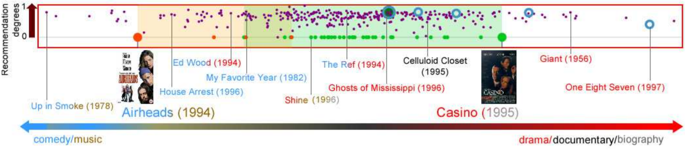
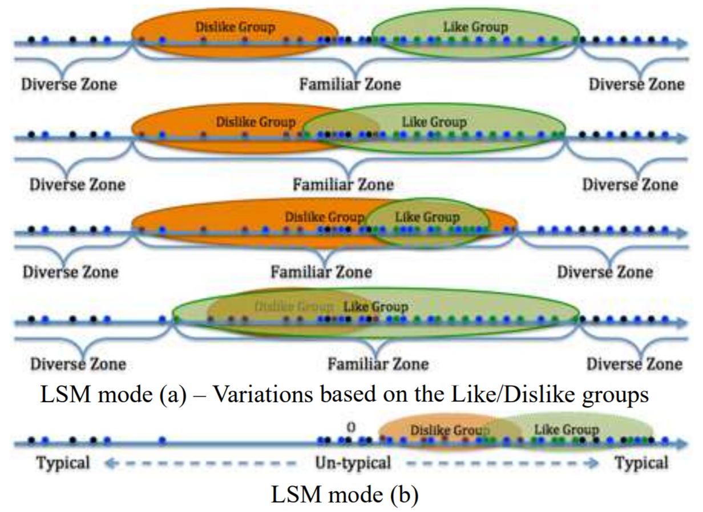
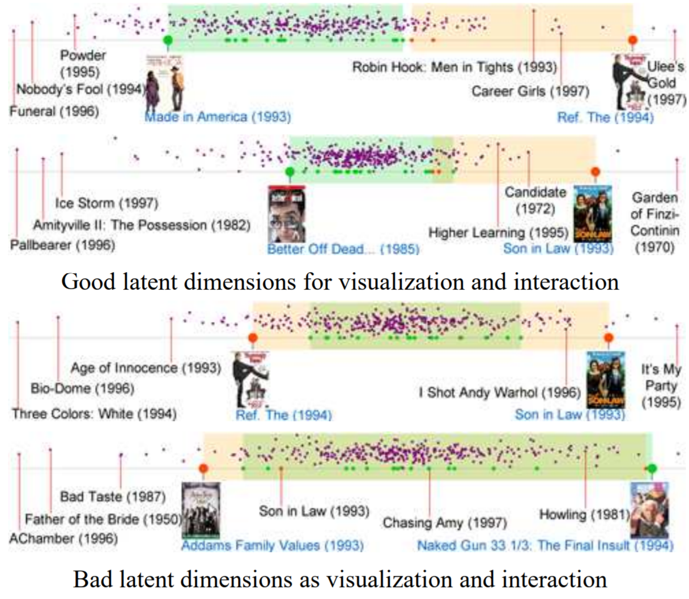
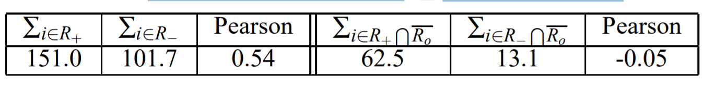
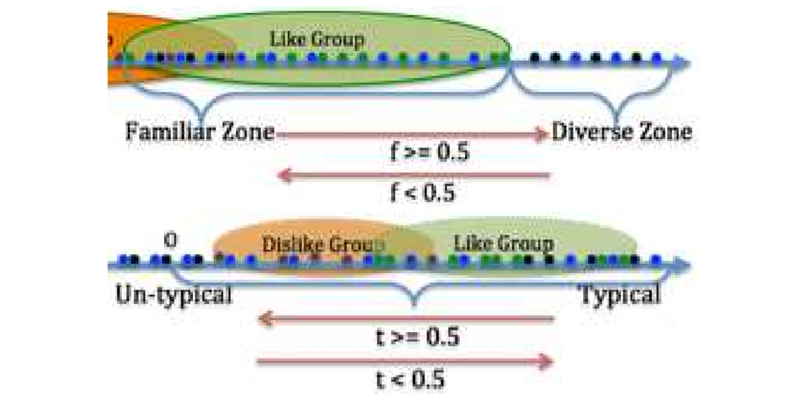
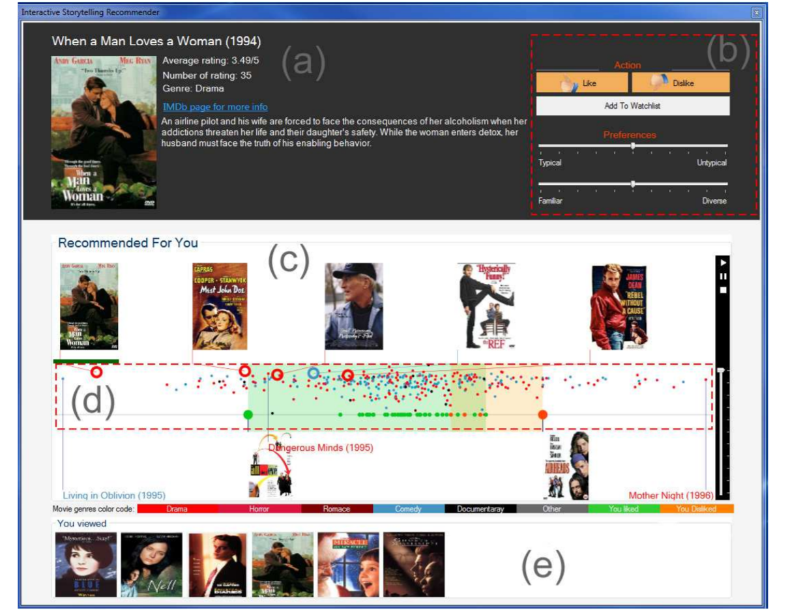
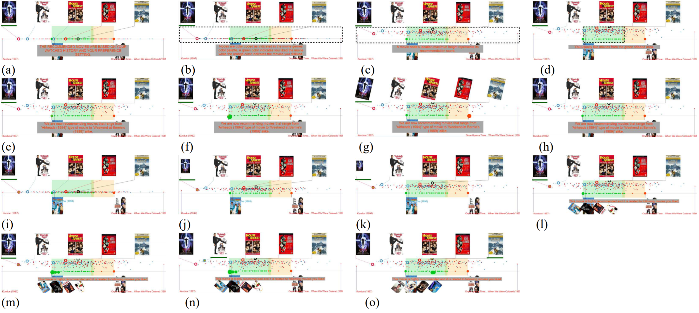
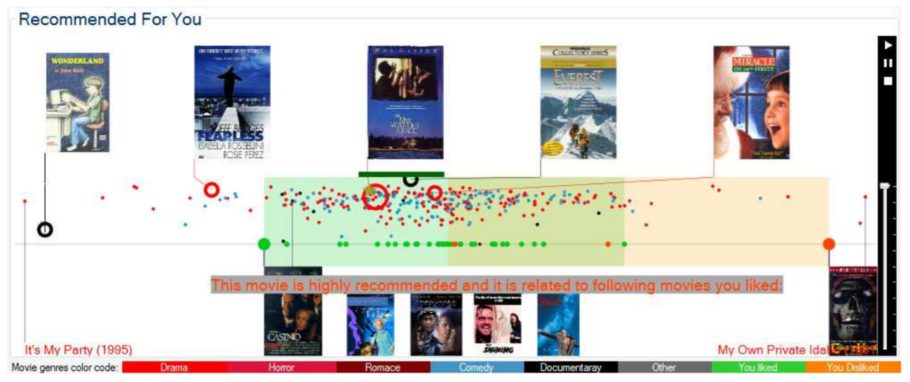
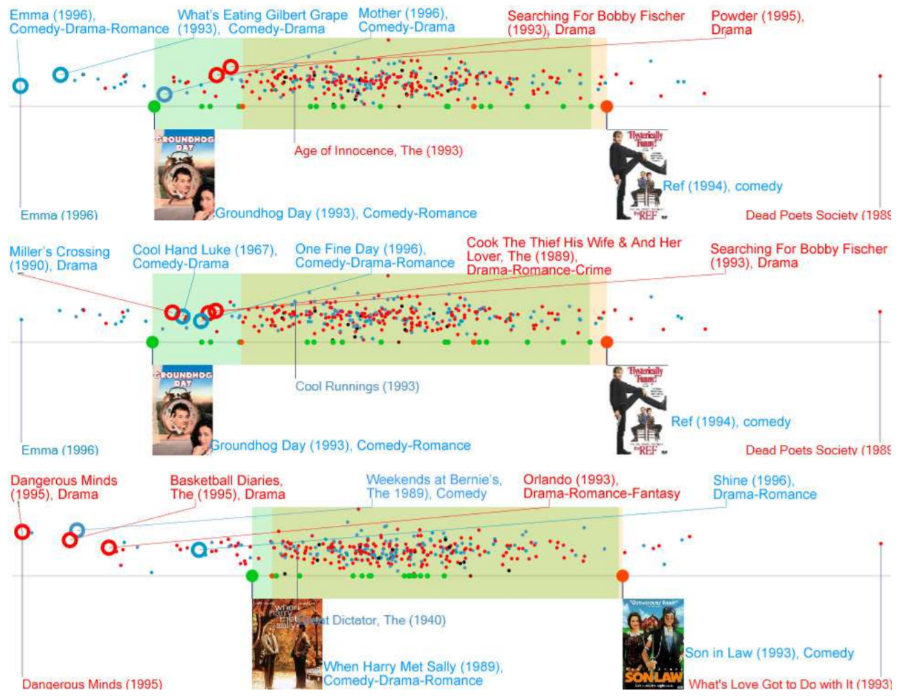
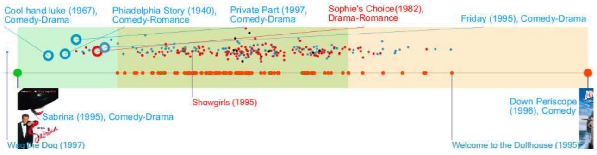

# 通过潜在语义分析和叙事的互动电影推荐

> Kodzo Wegba1, Aidong Lu1, Yuemeng Li1, and Wencheng Wang21University of North Carolina at Charlotte, USA,{kwegba1, aidong.lu, yli19}@uncc.edu2Chinese Academy of Sciences, China, whn@ios.ac.cn

> 图1：这是我们的潜在语义模型中的一个例子，它用于交互式推荐，以及对用户首选项进行抽象。我们的方法确定了一个2D可视化域，在水平轴上，根据用户的观看历史记录，在选择的两个组合电影特征之间的潜在维度上排布了可推荐的电影；而垂直轴上，则使用推荐度，将高度推荐的电影移动到顶部。这个例子说明了用户对戏剧/纪录片/传记电影（朝右的绿色区域）相对喜剧/音乐流派（朝左的橙色区域）的偏好。将选定的用来推荐的电影放大为蓝色圆圈，将推荐的电影显示为紫色节点，将已观看和喜欢的电影显示为绿色节点，将不喜欢的电影显示为橙色节点。这里还有两个示例电影海报，一个是喜欢的电影 “Casino”，另一个是不喜欢的电影 “Airheads”，以展示潜在的维度。出于说明目的，我们还在底部添加了箭头线和几个电影标题，以确认电影在可视化域中的分布。

## 摘要 ABSTRACT

推荐系统已经成了在线服务中改善销售记录的最重要的组件之一。然而在线推荐系统的可视化工作仍然非常有限。本文提出了一种交互式推荐方法，包括以下两个部分。首先，评级记录是在线推荐中使用最广泛的数据，但它们往往是在高维空间中处理的，不易理解或交互。我们提出了一种潜在语义模型（LSM），该模型捕捉了二维域上语义概念的统计特征，并提取了用户的偏好以供个人推荐。第二，提出了一种基于叙事机制的交互式推荐方法，以促进用户与推荐系统之间的交流。我们的方法强调互动性、明确的用户输入和语义信息传递，因此它可以被普通用户使用，而不需要任何注释或可视化算法的知识。我们用数据统计来验证我们的模型，并用MovieLens100K数据集的案例研究来演示我们的方法。我们的潜在语义分析和交互式推荐方法也可以扩展到其他基于网络的可视化应用，包括各种在线推荐系统。

## 1 介绍 INTRODUCTION

据报道，推荐系统是在线服务的关键支柱[14]，可以显著改善销售记录[26]。如今，在线零售商和内容提供商提供了大量的产品或服务，这些产品或服务往往让消费者望而却步。为了提高用户满意度和用户粘性，亚马逊、谷歌和雅虎等互联网巨头都在使用推荐系统来提供个性化的建议。然而，为消费者提供最合适的产品并不容易。尽管已经开发了许多推荐算法，包括流行的top-N推荐方法[7]，但仍然缺乏有效的交互机制，使消费者能够调整搜索偏好或推荐结果[28]。

提高用户满意度的挑战来自以下几个方面。第一，消费者的满意度随着情绪、情境等因素的变化而明显变化，这需要接收用户明确的输入。第二，帮助用户找到正确电影的有用信息，例如推荐电影和评分电影之间的相似性，这对用户来说通常是完全隐藏的。第三，复杂的推荐算法和可视化系统对于一般消费者来说，往往过于难以使用。据我们所知，在应对上述所有挑战方面没有任何工作进展。

在这项工作中，我们提出了一种交互式的推荐方法，它模拟了专家向用户推荐电影的场景——专家通常根据用户的观看历史为用户选择电影，进行推荐，然后听取用户的反馈，并继续推荐更多电影，直到用户找到要观看的电影。相似地，我们的方法也采用了这样一个连续的、交互式的推荐过程，允许用户主动地、明确地定位搜索结果。为了提高效率，我们建议将电影分组，每个分组包含从观看历史中提取的组合电影特征中选择的电影。如图1所示，对于一个喜欢大量戏剧、纪录片和传记电影的用户来说，我们在喜欢和不喜欢电影特征之间的维度上进行可视化电影分布，并根据用户偏好和多样性等重要标准进行推荐。这就要求我们从评分数据中研究个人电影的特点，并以简洁、用户友好的方式呈现推荐的电影，其中既有完整的信息，也有与用户评分的电影之间的联系。

我们的工作由两部分组成：潜在语义分析模型和交互式推荐方法。我们首先提出了一种基于电影分级记录分解的高维潜在空间的潜在语义模型（LSM），因为它们是在线推荐中最常用的数据。我们的模型收集了一组语义概念，包括喜欢、不喜欢、熟悉度、多样性、典型性和不典型性，这些概念可用于两个目的：一是帮助用户将新推荐的电影与用户观看的电影关联起来，二是允许用户明确地指定推荐结果的首选项。我们摘取了高维潜在空间中语义概念的统计特征，并自动识别出适合交互可视化的二维域。我们通过一个实际数据集验证了该模型的有效性，来证明该模型适用于多种类型的用户的推荐。

随后，我们在此基础上提出了一个互动式的推荐系统，该系统以叙事的方式推荐电影，以促进用户与推荐系统之间的交流。我们使用LSM模型来生成推荐故事，通过为电影分配合适的演员、角色和叙事结构来描述一组推荐电影。推荐故事是自动构建以吸引用户的注意力的，且支持多层次的可视化和动画效果，并可在交互推荐过程中灵活调整。与以前的在线推荐系统不同，我们的方法揭示了通常对用户隐藏的信息，并允许对电影相似性进行交互式探索。我们还提供了几个案例来说明LSM和交互式推荐在不同的推荐任务中的应用。

本文的其余部分组织如下。我们从第2节介绍相关工作开始。然后，我们在第3节描述了我们的LSM，在第4节描述了交互式推荐方法。我们在第5节介绍了推荐系统，第6节介绍了推荐结果。第7节总结了本文的工作，并提出了今后的工作方向。

## 2 相关工作 RELATED WORKS

这个章节展示了在交互式推荐系统、叙事方式以及叙事可视化上的前置工作。

### 2.1 可视化推荐 Visualization for Recommendation

与在给定的数据或任务中建议合适的可视化格式的可视化推荐主题不同的是，我们主要关注推荐系统的可视化方法，在推荐系统中通常采用图形可视化。例如，Luo等人[29]使用超字母和多模态视图来将推荐列表可视化。Kermarrec等人[20]使用SVD-like矩阵分解和PCA从高维到二维空间对电影评分进行全局映射。Crnovrsanin等人[5]提出了一种基于任务和信息的网络表示方法，使用户可以交互并可视化推荐列表。Vlachos等人[38]使用二部图和最小生成树来探索并可视化电影演员数据集的推荐结果。

交互式的推荐方法也有所进展。Gretarsson等人[15]用节点连接图将社交网络中的推荐用户可视化，并将推荐列表中的相关节点按平行层分组。Loepp等人提出了一种交互式推荐方法，让用户在两组样本项目之间迭代选择，并提取潜在因素[28]。最近，Loepp等人[27]展示了MyMovieMixer，它可以在混合推荐过程中以交互方式表达用户偏好。

我们的方法通过交互式叙事的方法动态地向用户推荐合适的电影。语义叙事的一个关键特性是用户不需要理解复杂的推荐算法或可视化技术。

### 2.2 叙事、叙事可视化 Storytelling and Narrative Visualization

“叙事”有着悠久的历史，并且它已经成为一种可视化技术[13，34，30，22，24，41]。虽然叙事视觉化这个术语相对较新[36]，但它也指使用数据故事来改善视觉传达[17，19，35]。

叙事结构是叙事学和叙事可视化的核心概念。它指的是牛津英语词典中的“一系列事件、事实等，按顺序给出并建立它们之间的联系”，在可视化系统中，它通常被简化为开头、中间和结尾等结构[36]。为了理解有用的叙事结构可视化，来自新闻学[36]和政治信息和决策学[17]的研究已经完成。

从一般的可视化过程[6，12]到特定的领域，已经有几种交互式或自动的故事讲述方法被开发出来。例如，Wohlfart andHauser[40]将叙事作为一种指导性的、交互式的医学图像呈现方法可视化。Eccles等人[9] 检测地理时间模式并整合故事记录，以增加地理时间的分析意义。Yuet等人[42]利用从事件图中提取的叙事结构生成自动动画，用于随时间变化的科学可视化。Hullman等人[19]提出了一种图形驱动的方法，用于自动识别线性呈现的一组可视化中的有效序列。Lee等人[23]提出了一个叙事的过程，包括寻找洞察力、将洞察力转化为叙事、与观众交流等步骤。Satyanarayan和Heer[35]开发了一个叙事的抽象模型，并省略地用一个故事创作的图形界面来证明这个模型。Wang等人提出了一个叙事可视化系统，该系统将文献综述呈现为具有三层叙事结构的交互式幻灯片[39]。Bryan等人[4]通过时间布局和连环画风格的数据快照生成文本注释，来可视化多维且随时间变化的数据。

叙事已被证明在许多应用程序中有效地传递数据[8，37]。对于可视化任务，尽管叙事似乎没有增加用户在探索中的参与度[3]，但有注释的可视化被证明在平衡图形的显著性和相关性方面表现更好[18]，图形漫画有助于帮助普通观众快速理解复杂的时间变化[2]。尽管如此，很明显我们也应该根据应用需求提供和调整灵活的创建过程[31，11，1]。

与其他叙事技术不同的是，我们提出了一种高度交互式的叙事方法，该方法模拟了人类的交流，且具有两个特征：在有或无用户输入的情况下持续更新故事，并允许在探索数据、制作故事和叙述故事这些所有阶段进行交互。

## 3 交互式推荐和电影探索的潜在语义模型  LATENT SEMANTIC MODEL FOR INTERACTIVE RECOMMENDATION AND MOVIE EXPLORATION

我们的面向普通用户的交互式推荐方法由两个部分组成：用于提取个人电影偏好的LSM（第3节）和带有叙事的交互式推荐（第4节）。在本节中，我们首先介绍协同过滤算法中的潜在空间。然后我们描述了我们的推荐方法和推荐度的度量。最后，本文提出了一种基于语义概念集将高维数据统计转化为推荐域的LSM方法。LSM也用于在第4节中设计推荐叙事和用户交互。在这项工作中，LSM和交互式推荐系统的设计是同时进行的，以确保同一套语义概念可以用于电影的交互式推荐和探索。

### 3.1 协同过滤的潜在空间 Latent Space from Collaborative Filtering

为了提供一个有效的交互式推荐系统，我们需要将推荐算法集成到可视化机制中。潜在因素模型是协同过滤（CF）技术的主要方法，已经被许多商业系统成功地采用[21]。基于奇异值分解（SVD）的潜在因子模型通过将电影和用户转换到同一个潜在因子空间，从而直接让他们具有可比性。我们选择这个潜在的空间，因为它不仅可以用来探索推荐的电影，同时也从语义角度分析了电影和用户的分布模式。

潜在空间可以用来解释许多偏好/相关性特征。例如，喜剧到戏剧的维度可以用来表示用户对这两种电影类型的偏好。在大多数情况下，潜在空间捕获了综合所有用户特征的评级记录的统计分布，这些特征通常很难直接描述或理解。为了区分用户和电影，我们为用户和电影保留了特别的索引标记。分级规则表示用户对电影的引用，分级值在{1,2，…，5}集合中，1表示无兴趣，5表示有强烈兴趣。

我们利用奇异值分解（SVD）对用户-电影评级矩阵进行因式分解，生成潜在空间。对于具有m个用户和n个电影的用户-电影矩阵M，SVD算法将这个矩阵分解为M=USV T 这样的三个矩阵。为了降低向量空间的维数，通常会将这些矩阵截断为Uk、Sk和Vk三个部分，并且只在模型中留下最强的影响，即用较小的奇异值降维[10]。具体地说，Uk的行是用户对每种特性的兴趣，列是每种特性的电影相关性。对角线矩阵Sk包含M的k个最大奇异值，它们是偏好的权重，表示特定主题对用户电影偏好的影响。

### 3.2 推荐的电影和推荐度 Recommendable Movies and Degrees

在一次推荐方法中，我们对以下两种事情最感兴趣：推荐的电影，以及用于解释我们推荐电影的可能性的推荐度。我们遵循典型的推荐算法，通过调整评分历史与全球影响的规范化。这一步平衡了一些用户喜欢给出比其他人更高的评分和一些电影获得比其他人更高的评分的倾向，因此调整后的 rui 能够更准确地比较不同的用户或不同的电影。表示Au为用户u给出的平均评分，Ai为i这部电影的平均评分，以及A和B分别为所有用户和所有电影的平均评分。

公式1
rui = rui - (au - A) - (ai - B)

我们的推荐算法首先通过将邻接矩阵M和SVD的Vk分量相乘，将每个用户映射到潜在空间。我们将此乘积表示为C=M×Vk，其中Cu表示来自矩阵C的用户u的行向量。然后，我们使用Cu和Cv坐标计算用户u和v之间的余弦相似性suv[25]。

公式2

接下来，我们选择具有正相似系数的相似用户列表，因为推荐电影通常是基于相似用户的评分来选择的。对于用户u，我们将这个集合表示为Su={v | suv≥0}。对于没有评分记录的新用户，所有相似性系数suv为零，集合Su包含所有用户。

我们进一步通过选择未被u观看但从类似用户接收到正评级的电影来为用户u选择可推荐电影的列表Lu，如下所示，其中正评级阈值Wc被初始化为3并且可以针对不同数量的可推荐电影进行调整。

公式3

此外，我们还利用bui度量了用户u对电影的推荐度。在互动推荐中，bui度高的电影更容易被推荐过程。它计算为具有正余弦相似性的相似用户的平均评分。对于任何i∈Lu，

公式4

我们将suv和bui值分别标准化为[-1,1]和[0,1]的范围，以平衡用户之间的差异。

### 3.3 潜在语义模型 Latent Semantic Model

潜在空间在推荐算法中得到了广泛的应用，但它是一个高维空间，不适合直接进行可视化和交互。我们的目标是确定语义概念和可视化领域，可用于交互式推荐和探索电影相似之处。我们的该方法包括以下三个步骤：分离电影组，识别一组语义概念，选择合适的潜在维度进行交互推荐。

#### 3.3.1 分离电影组 Separating Movie Groups

为了识别可推荐的电影，我们根据用户的评分历史和我们对推荐度的估计，将数据库中的所有电影分为五组。对于任何用户u，每部电影都属于且仅属于以下组中的一个。

- 喜欢（用户u给出了积极评价）：G+={i|rui≥τ+}

- 不喜欢（用户u给出了消极评价）：G−={i|0<rui<τ−}

- 一般般：Gneu={i|τ−≤rui<τ+}，

- 推荐的（有正面推荐倾向）：Gr={i | bui≥τr}，且用户在交互推荐过程中没有点“踩”

- 不推荐的（有负面推荐倾向）：Gn={i|bui<τr}，或者用户在交互推荐过程中点了“踩”

正评级τ+和负评级τ−的阈值设置为值3，推荐度τr的阈值最初设置为值0。可以调整这些值以控制每组中的电影数量。

#### 3.3.2 推荐的语义概念 Semantic Concepts for Recommendation

在日常生活中，我们经常用几个词来描述一个物体，比如一个人的家人、朋友和敌人。类似地，一组语义概念可以用来描述电影以获得快速印象，这可以帮助用户有效地找到电影。

除了“喜欢”和“不喜欢”之外，我们还根据两个标准：公众推荐中经常使用的概念、在潜在空间中具有明显分布特征的概念，来确定了以下四个推荐语义概念：

- 熟悉度–用户已经观看过的电影风格

- 多样性–用户不熟悉的电影风格

- 典型性-基于结合电影的特点，那些可以很好地定义的电影风格

- 非典型性-特征不明显的电影风格

> 图2：LSM映射了一组语义概念在潜在空间中的分布。为了清晰起见，我们将LSM的两种模式分开—（a）包括相似性、不喜欢性、熟悉性和多样性的概念，（b）包括典型性和不相似性的概念-典型性电影节点的颜色基于组-喜欢的为绿色，不喜欢的为橙色，推荐的为蓝色，不推荐的为黑色。

接下来，我们描述了语义概念在潜在空间中的分布特征。如图2所示，我们可以通过同时包含“喜欢”和“不喜欢”组来识别“喜欢”区域，即用户u观看的所有电影。多样性区域是在熟悉区域之外的区域，在潜在维度的每一侧通常有两个多样性区域。图3使用真实场景中的示例来显示LSM模式（a）的变化。

> 图3：根据第3.3.3节所述标准选择的好和坏示例潜在维度。喜欢和不喜欢的区域分别用绿色和橙色的阴影矩形突出显示。推荐的电影是紫色的，“喜欢”的电影是绿色的，“不喜欢”的电影是橙色的。

典型性和非典型性之间的LSM模式（b）利用了电影到潜在空间原点的距离。由于来自潜在空间的Uk和Vk都表现出相似用户和电影的聚类特征[32]，因此潜在空间中的距离可以解释相似程度。例如，在一个潜在维度上，一方面包含喜剧电影，另一方面包含戏剧电影，具有喜剧/戏剧或其他类型组合的电影分布在原点附近。这一特征类似于光谱空间，即连接较少的节点通常位于原点附近[16]。重要的是，这种特性保留了描述组合电影特征或风格的一般潜在维度，只有不典型的电影对应于靠近原点的潜在维度。如图2模式（b）所示，任何潜在维度都可以建模为典型到非典型到典型区域。这两个典型区域对应于潜在维度所代表的两个相对的特征。

语义概念在语义维度上的分布特征明显，但语义区之间的相对位置因来源和熟悉区而异。例如，相似和不相似区域可以出现在原点的任一侧，或者与原点重叠。然而，它们都为交互式推荐提供了有价值的语义信息。我们通常可以调整τ+、τ-、和τr的阈值，以确保所有语义区都包含可推荐的电影。

#### 3.3.3 为可视化和交互选择维度 Selecting Dimensions for Visualization and Interaction

在潜在空间中，每个维度都描述了电影和用户的某些联合统计特征。我们感兴趣的是搜索能够帮助用户理解电影关系的维度，以及适合可视化和交互的维度。我们不仅要选择一个维度，还要选择一组合适的维度，这样才能涵盖可推荐电影的多个方面。然而，并非k维潜在空间中的所有维度都适合于推荐，因为它们可能表示不相关电影或用户的特征、来自其他维度的重复特征或难以理解的特征。因此，我们将根据语义概念的分布经历以下的选择过程。

选择是基于用户历史、推荐度和用户交互的明确信息的组合信息-特定电影的点赞或踩，这会在第4节中描述。我们倾向于用以下三个因素来选择分隔语义区的维度：

- 组大小。对于每个维度，我们将喜欢组的区域测量为R+，不喜欢组的区域测量为R-，重叠区域测量为Ro，组合范围测量为R。理想的情况是，R+占据R的很大一部分，因为大多数推荐电影都选择在该区域内或附近。我们也希望R+和R-不覆盖整个维度，这样就有了多样化的空间区域。这个因子简化为R+/R。

- 重叠区域。我们尽量避免图2中的第三和第四种LSM模式（a），当一个组位于另一个组中时会发生这种情况。因为这些维度的含义很难描述和理解，所以它们不那么令人满意。我们设置了较大的惩罚，以避免Ro/R+和Ro/R-出现较大的重叠比率。

- 推荐电影的发行。在R+内部，最理想的情况是推荐的电影均匀分布。这个因素有助于移除许多电影映射到小范围的维度，这表明这些电影的特征和差异在维度上没有得到很好的表示。我们用R+中推荐电影的标准差θ+来测量这个因子。

具体而言，我们使用以下Dv方程来测量潜在维度v是否适合作为可视化域，其中w+、wo和wθ是上述三个因素的权重。

公式5

接下来，我们通过去除类似的数据，过滤由高Dv值的潜在维度组成的se tSd={v | Dv>τv}尺寸。这个这是通过比较电影的位置和两个维度上的组来实现的。在具有高Ds值的相似维度中，只有Dv值最高的维度保留在Sd中。

公式6

其中，p∈Sd和q∈Sd是潜在维度，wi是每个电影的权重，以纳入用户偏好，R+p和R−p是p上的喜欢和不喜欢组的范围。我们最初为所有电影设置wi=1，当用户单击点赞/踩时，该值加倍。

### 3.4 模型验证 Model Validation

我们从两个方面用一个真实的数据集来验证LSM。首先，测试MovieLens 100K数据集中所有用户的LSM[33]。对于本文的所有结果，我们用4表示τ+，2表示τ-，5表示w+，10表示wo和wθ。最佳的潜在维度被自动选择，并用来衡量LSM如何区分相似区域和不相似区域。结果表明，在图2（a）的情况1或情况2中，所有用户的最佳维度都包含理想的组分布，这表明LSM可以应用于具有不同评级历史的用户。

其次，我们观察了可推荐电影在最佳潜在维度上的分布。因为每一部推荐的电影都可以出现在搜索结果中，所以我们收集了一组中所有电影的广告总量。值得一提的是，不喜欢的区域还可能包含可推荐的电影，因为推荐的选择来自多个方面。另外，两个用户对一部电影的评价相似，而对另一部电影的评价却非常不同，这会使统计分布复杂化。如表1所示，所有用户的R+平均值明显高于R-。如果我们把R+和R-的重叠区域去掉，差别就更大了。我们还计算了皮尔逊相关来比较统计中两对的值。通过去除重叠区域，第二对非常接近无相关性。这一结果表明，LSM捕获了同类区域中的大多数可推荐电影，用于进行推荐。

> 表1：不同地区bui总和的比较

## 4 通过叙事的交互式推荐 INTERACTIVE RECOMMENDATION THROUGH STORY-TELLING

本节首先介绍如何将推荐过程与讲故事联系起来。然后，分别从角色、角色、用户交互和叙事结构等方面提出了通过LSM自动构建推荐故事的策略。

> 图4：在用户和我们的交互式推荐系统之间建立了一个连续交流的讲故事管道。用户可以随时与系统交互，提示喜好，浏览电影信息，加速推荐过程。

### 4.1 将推荐与叙事联系起来 Connecting Recommendation to Storytelling

如引言所述，我们提出交互式推荐来模拟专家向用户推荐电影的场景。在推荐过程中，专家通常会呈现一部或几部电影，并给出推荐理由，如人气高、与用户喜欢的电影相似度高、或者有特殊特征等。用户可以通过指示他或她对所推荐电影的偏好来响应，例如“推荐更多这样的电影”或“不再推荐那样的电影”。这个过程会一直持续，直到用户找到一个有趣的电影来观看。

为了模拟这种交流过程，我们提出了一种存储讲述机制，将推荐电影的过程视为讲述故事。我们将一个**推荐故事**设计为一组可推荐的电影和简要的推荐理由，并将**交互推荐方法**设计为一个连续的讲故事过程，该过程可以根据用户的行为进行及时调整。如图4所示，交互式讲故事管道从为用户探索电影数据库开始，选择可推荐的电影，并使用第3节中描述的LSM收集必要的信息。然后，“制作故事”的第二步是使用本节描述的方法自动生成推荐故事。第三步“讲故事”是将一个故事呈现为第5节中描述的动画序列。

“制作一个故事”、“讲述一个故事”和“用户”之间的循环提供了建议的连续和交互式的推荐过程，直到一个理想的电影被确定。从“user”到“make a story”的箭头表示用户可以提供反馈以请求反映用户的新推荐故事输入从“user”到“tell a story”的箭头表示用户可以交互地调整讲故事的动画，例如重播推荐的电影或立即完成故事。如果用户不提供输入，则循环继续执行不同的推荐故事，以达到“您可能喜欢的其他类型的电影怎么样？”？不同推荐故事之间的自动切换可以避免用户对类似电影感到厌烦。在此过程中，用户还可以使用我们的交互工具来探索电影的附加信息。

与之前的讲故事流程[24]不同，我们的交互式推荐方法主要是由三个组件组成的有序序列，即探索数据、制作和讲述一个故事，它由1）交互功能支持，允许用户在过程中的任何时间与讲故事管道进行交互，2） 自动构建叙事结构，允许不断生成新的和调整后的推荐故事。

### 4.2 人物 Character

普通故事中的人物通常是一个人。在我们的故事里，角色是电影。与胡曼角色类似，每个电影角色都与用户保持着不同的关系，例如一部分级电影、一部喜爱的电影或一部可推荐的电影。电影角色之间也有关联，比如被同一个用户评分或者平均评分相似。因为我们的重点是推荐，所以主要的角色是可推荐电影，它与用户的关系可以用LSM和推荐度来表示。

### 4.3 角色 Role

角色描述每个角色在角色中的作用故事。故事可推荐电影的角色为用户浏览电影数据库提供了一种机制。在浏览电影细节之前，电影的角色提供了一个电影特性的快速捕获，例如一个典型的戏剧电影，它与用户最喜欢的电影之一非常相似。这为用户提供了一个快速的方法来找到几个感兴趣的电影进行探索。

在推荐故事中，我们使用LSM中的语义概念来描述角色，例如用户评价较高的“喜欢”电影或具有某些电影类型的强烈特征的“典型”电影。每个电影角色都可以扮演多种角色，比如熟悉和不典型，就像一个人类角色既可以是同事，也可以是朋友一样。电影角色的实际角色是由所选潜在维度上语义区之间的位置决定的，如图2所示。

### 4.4 推荐过程中的用户交互 User Interaction During Recommendation

对于交互式推荐，用户交互成为讲故事管道的重要组成部分。为了允许用户与图4所示的讲故事管道进行主动交互，我们提供了三组显式交互函数，如下所示：

第一组交互功能是从“用户”到“编写故事”。对应于电影的角色，用户可以在熟悉的（f）/不同的以及典型的（t）/不典型的电影选项之间指定首选的电影类型。参数值在生成新的建议存储时立即生效。对于特定的电影，用户可以赞（like）和踩（dislike）按钮，以便将指定的电影移动到喜欢组或不喜欢组（以及不推荐的组，以便将其从推荐过程中删除）。我们还在等式5和等式6中增加电影的wi值（控制用户选择效果的参数），以便为新故事选择潜在维度。对于每个维v，新的度量D′v包含Dv数据分布和用户交互的分量。我们检测用户偏好是否与LSM一致，特别是喜欢的电影是否在喜欢范围内，或者不喜欢的电影是否在不喜欢范围内。

公式7

其中U+和U-是包含用户指定的所有喜欢或不喜欢的电影的集合。

第二组交互功能是从“用户”到“讲故事”。要控制动画故事讲述，用户可以回放、暂停和停止当前的推荐故事，或播放更多故事（默认情况下继续推荐其他电影）。

第三组是探索电影细节。如果找到一部电影，用户可以点击界面上的电影海报或电影节点查看详情。用户还可以随时将鼠标移到一个电影节点上，显示一组基本信息，包括用户评分、平均评分、人气、标题和类型。

### 4.5 叙事结构的自动生成 Automatic Generation of Narrative Structures

叙事结构是指故事中事件的顺序。在推荐故事中，每一个事件都是一部可推荐的电影和简要的推荐理由。在叙事结构中，一组可推荐电影的顺序对于提高用户对电影的理解是至关重要的。

考虑到在线推荐中用户关注度较低，我们更喜欢那些能在很短时间内完成的简单故事。因此，我们只使用LSM选择的一个潜在维度来生成每个推荐故事。由于每个潜在维度反映了一个组合的电影/用户特征，这样的推荐故事模拟了我们从一个组合的电影特征向另一个推荐电影的效果，例如从流行的戏剧/喜剧电影到不受欢迎的纪录片。利用本文提出的最小二乘法设计推荐故事也是可行的。例如，长篇故事可以通过连接不同的潜在维度而产生。由于我们的交互式推荐方法的重点，我们在这项工作中只使用短篇故事。

基于潜在维度，我们试图通过在熟悉性、多样性、典型性和非典型性四个语义概念之间生成线性叙事结构来维持故事的平稳过渡。这是通过确定一个起点，根据用户偏好选择叙事结构，并选择可推荐的电影来实现的。

故事的**起点**是根据用户对f和p的偏好来确定的。f和p的默认值都是0.5，尽管我们喜欢典型电影而不是不典型电影，喜欢熟悉电影而不是多样化电影，这与大多数人的偏好是一致的用户下面的列表是我们设置为默认的顺序。

高度熟悉：从同类群体开始
高多样性：从更接近同类群体的多样性区域开始
高典型性：从更接近同类群体的典型区域开始
高不典型性：从不典型区出发

> 图5：四种线性叙事结构基于【t - 典型、u=1-t - 不典型、f - 熟悉、d=1-f - 多样性】这几种用户偏好。

推荐电影的**顺序**也考虑了用户的偏好。如图5所示，我们使用四种叙事结构来覆盖f和t两种用户偏好的所有组合。叙事结构被设计为线性序列，因此用户可以在交互推荐过程中期望非常相似的叙事可视化。由于叙事结构每次都在一个潜在的维度上，LSM的两个区域被卷入其中。图5还显示了选择推荐电影的潜在维度的范围。在互动故事讲述过程中，我们在两个选项之间随机切换叙事结构，以避免简单的故事重复。

**推荐电影的选择**基于根据用户偏好f和t计算的样本率。假设为每个叙事结构选择一个组GT，其中有t个推荐电影。当结构介于典型性和非典型性之间时，我们确定典型区推荐电影的数量为st，非典型区推荐电影的数量为su：

公式8

同样，当结构介于熟悉性和多样性之间时，熟悉区sf和多样区sd的抽样数为：

公式9

在每个区域内，我们使用以下程序选择推荐的电影，该程序由本地采样和随机测试程序组成。我们首先随机选择一个位置，然后在一个局部窗口内综合三个因素来选择最佳的候选位置：候选电影i的推荐度bui，电影i到位置l的距离，电影i到用户指定的q电影集的相似度。在潜在维度Vp上，假设电影i的位置是Vp（i）。用户指定电影的效果被设置为在具有截断高斯函数Gq（）的位置窗口δ内，对于点赞的电影具有高权重，对于点踩的电影具有低权重。从以下组合测量中选择值最高的影片作为最佳候选影片。

公式10 

另外一个随机测试的目的是确保我们对推荐电影的选择符合两个用户的喜好，尽管只有一个因素被用来决定叙事顺序。如果所选影片通过随机测试，我们将其添加到所选集GT；否则，我们选择另一个随机位置并再次执行局部采样。例如，对于熟悉性和多样性之间的叙事结构，我们试图保持一个接近用户偏好t的平均典型值，我们将电影i的典型值测量为t（i）=Vp（i）|。测试取决于电影i是否能使平均典型值更接近t。

公式11

同样地，对于典型性与非典型性之间的叙事结构，我们测量了一部电影的熟悉度值，即给定c+组的中心位置为f（i）=| Vp（i）−c+|。通过将上述等式中的t（i）替换为f（i）来执行随机试验。

由于电影数据库通常很大，我们可以假设总是有足够的电影可以推荐。在推荐影片用完的情况下，我们可以调整参数τ+和τ-以包括额外的影片。

## 5 交互式推荐系统 INTERACTIVE RECOMMENDATION SYSTEM

本系统的界面设计与Youtube、Netflix和亚马逊电影等流行的商业推荐系统保持一致。如图6所示，我们的系统包含三个常见的组件—一个带有信息的放大电影海报（a）、前N名推荐电影列表（c）和底部的附加信息（e）。我们增加了一个用于用户交互的小区域（b）和一个可视化域（d），以支持交互式推荐和电影数据库的探索。我们的系统还支持以下交互式推荐功能。

### 5.1 基于样例的叙事结构 Example-based Narrative Structure

潜在维度的可视化对于说明可推荐电影和电影分布具有重要作用。为了直观地描述叙事结构，我们设计了一种基于示例的方法，如图1、3、6所示，它使用用户观看的两部电影，一部在家庭区域的两侧，来描述潜在维度的组合特征。由于组合特征仅由数据统计产生，因此通常不能用语言或方程来描述。示例电影帮助用户了解潜在维度的总体趋势，并通过与两个示例之间的距离快速印象一部新电影。所有值得推荐的电影都位于潜在维度和推荐度的2D域上，为推荐原因提供额外的视觉效果。

> 图6：推荐系统的界面。与在线电影推荐系统类似，我们的界面包括（a）所选电影的基本信息，（c）可推荐电影的列表，以及（e）观看历史。我们还增加了（b）用户偏好的显式输入和（d）探索可推荐电影的可视化。

### 5.2 多层次可视化 Multi-Level Visualization

推荐一部电影的理由有很多种。虽然LSM支持的理由主要来自统计相似性和语义分析方面，但我们可以提供大量信息作为推荐的“简短”理由，例如用户熟悉区域中的典型戏剧电影，类似于海报中显示的示例电影。我们将可视化领域中的信息分为三个层次进行组织，使讲故事的动画能够遵循这三个层次，达到逐步引入附加信息的效果。如果用户对电影不感兴趣，可以随时停止，继续下一次推荐。

如图7的图像（i）所示，第一级提供具有喜欢和不喜欢区域的潜在维度的基本信息，其中被推荐电影的节点被画成圆。用户观看过的电影的节点被着色为绿色，可推荐电影的节点根据其类型被着色。提供了两个示例电影来说明潜在维度并与其他电影进行关联。

第二级介绍了推荐电影的垂直位置的推荐度。如图7的图片（j）和（k）所示，具有较高推荐度的电影被放置在顶部以吸引用户注意。缩放可以在动画中自动完成，也可以由用户在浏览电影数据库时进行交互式调整。

第三级为探索电影提供了最丰富的信息。对于被推荐的电影，我们展示了用户观看过并喜欢加强推荐理由的四大类似电影，如图7的图（l）和（m）所示。这四部电影都有很高的用户评分，在潜在维度上与推荐的电影接近。我们还根据类型为所有电影节点上色，并添加彩色链接将海报连接到电影节点。

### 5.3 动画效果 Animation Effects

我们的系统提供全自动动画来“讲述”推荐故事，并提供以下三组动画效果。

> 图7：讲故事动画的示例快照。我们首先向新用户介绍系统界面，例如使用评分历史（a）、色码（b）、推荐度（c）和喜欢的区域（d）。我们也用电影的例子来说明潜在的维度，并用海报转换（e-h）来吸引用户的注意力。接下来，我们将通过设置电影节点的动画并在其海报（i）下显示一条绿线来介绍第一个推荐的电影。可视化域从第一层（i）、第二层（j-k）逐渐变为第三层（l-m）。使用相同的步骤（i-m）分别为第二个（n）到最后一个（o）推荐的电影制作动画。

第一套动画是介绍系统组件。一步一步地，用图7中的图像（a-d）所示的简短描述突出显示每个组件。用户可以随时重放或跳到下一个动画集。

第二套动画是介绍一个故事的叙事结构。我们使用我们的基于示例的方法来动画化推荐的电影以引起用户的注意，并使用两个从左到右的示例电影来提供维度意义的印象。具体地说，每个示例电影海报通过改变其大小来设置动画，并且电影节点也同时设置动画，如图7（e-h）所示。

第三个动画集是展示一个推荐故事，如图7中的图像（i-o）所示。当推荐列表中的海报为动画时，我们通过在可视化面板中闪烁“电影”节点来高亮显示选定的电影。电影海报下方的绿线也表示聚焦的电影。然后，我们将视觉化从第一级逐步切换到第三级，以提供所选电影的详细信息。具体地说，在显示第一级之后，可视化面板中的电影节点在第二级中逐渐缩放到其最大推荐度。从第二级到第三级，这组类似的电影都是动画。我们对故事中所有选定的电影使用相同的动画程序，以避免混淆。用户可以观察所有信息或随时切换到下一个推荐的电影。

当推荐故事的动画结束或用户选择电影进行进一步探索时，将自动生成新故事。该系统重新引入新的叙事结构，并重复动画序列来传达新选定电影背后的故事。

## 6 结果和案例研究 RESULTS AND CASE STUDIES

### 6.1 案例研究 Case Studies

本节介绍了使用MovieLens100K数据集进行的三个案例研究[33]。该数据集有1到5个级别的10万部电影，943个用户对1682部不同类别的电影进行了评分。我们选择了具有不同背景和评级历史的用户来演示我们的方法。

**第一个用户**是一名从事娱乐业的21岁男性。如图6所示，一个潜在的维度被确定在右边的喜剧电影和左边的戏剧/浪漫/传记类型之间。作为典型性/非典型性和熟悉性/多样性的默认首选设置0.5/0.5，我们的推荐系统从熟悉区域的戏剧类型电影开始，并继续以戏剧和浪漫类型为多样性。推荐的电影有：《When a Man Loves a Woman》（1994年，戏剧，浪漫）、《Meet John Doe》（1941年，戏剧，浪漫，喜剧）、《Nobodys Fool》（1994年，戏剧，喜剧）、《Ref The》（1994年，喜剧，戏剧）、《ebel Without a Cause》（1995年，戏剧）。

我们将推荐结果与用户的观看历史进行比较。该用户对44部电影进行了评分。其中，约68%的电影是戏剧或戏剧与浪漫的结合。他们的平均得分很高（4.30）。其他类型的电影评分较低，尤其是喜剧电影。因此，我们的结果捕捉到了用户对戏剧电影类型的偏好。

**第二个用户**是一名28岁的男生。图8显示了用户的第一组推荐结果。潜在维度以戏剧、纪录片、喜剧等类型传播电影，具有正面影响（如爱情、戏剧）向左、负面影响（如恐怖）向右的组合特征。从不同到熟悉的区域推荐了五部电影：《Wonderland》（1997年，纪录片）、《Fearless》（1993年，戏剧）、《Man Without a Face》（1993年，戏剧）、《Everest》（1998年，纪录片）和《Miracle on 34th Street》（1994年，戏剧）。

在没有用户输入的情况下，我们的系统会继续添加一组新的电影，如图9的第一行所示。用户还可以调整推荐首选项并选择他们感兴趣的电影，如图9的第二行和第三行所示。

我们将推荐结果与用户的观看历史进行比较。他对34部电影的平均评分为3.64，这些电影来自喜剧、戏剧、恐怖和浪漫类型。评级记录显示他喜欢戏剧和浪漫电影。我们的推荐结果推荐用户熟悉区域的大多数电影，并引入混合冒险/纪录片/戏剧电影以实现多样性。

> 图8：第二个用户的结果描述了用户对他喜欢的爱情/戏剧电影的偏好向左，而对他不喜欢的恐怖/喜剧电影的偏好向右。

> 图9：第二个用户的交互示例。第一行显示了另一个故事片，描述了用户对《Groundhog Day》（1993年，喜剧，浪漫）与《Son in Law》（1993年，喜剧）偏好的不同方面。第二行显示，当用户将熟悉的首选项切换为1时，所有推荐的电影都来自熟悉区域。当“典型”和“多样化”首选项都设置为1，并且从推荐列表中选择电影“一个好日子（1996）”时，最下面一行显示了结果。

**第三位用户**是一位26岁的男性高管。如图10所示，潜在维度由左侧评级较高的戏剧喜剧电影“Sabrina（1996）”和右侧评级较低的喜剧电影“Down Periscope（1996）”界定。我们的系统推荐了五部来自戏剧电影的电影，这些电影与熟悉地区的其他类型相结合，例如《Cool Hand Luke》（1967年，喜剧，戏剧）、《Philadelphia Story》（1940年，喜剧，戏剧）、《Private Part》（1997年，喜剧，戏剧）、《Sophies Choice》（1982年，戏剧，浪漫）和《Friday》（1995年，喜剧，戏剧）。

我们将推荐结果与用户的观看历史进行比较。他为120部不同类型的电影评分，如喜剧、戏剧和恐怖片。他的评分大多是1星或2星，他只给6部电影评了4星或5星。我们的结果反映了他的低评分记录，有一个大的不喜欢区域和一个小的喜欢区域地区潜在维度描述了电影类型，从左边的戏剧喜剧电影，到用户右边评价较低的各种其他电影类型。这样的用户通常对电影的选择很挑剔，但我们的模型仍然捕获了他最喜欢的电影类型，并创建了一个匹配的推荐故事。

> 图10：第三个用户的结果显示了一个挑剔的用户，他对许多电影的评价都很低。我们的方法确定了用户对喜剧戏剧电影（向左）的偏好，而不是其他类型（向右）的偏好。

### 6.2 系统表现 System Performance

本系统的预处理包括第三节所述的计算，包括评分记录的处理、SVD空间的构造、推荐影片的选择以及用户的潜在尺寸。这一阶段的表现取决于电影数据库和分级记录的大小。对于940名用户的370部电影的30000个评分，预处理需要3-10秒，而对于配备Intel Core i7 2.93 GHz处理器的台式计算机上的Movie100K数据集，预处理需要几分钟。

在交互式推荐阶段，第4节和第5节中描述的所有可视化、交互和讲故事过程都是交互式的。这对于在在线系统中提供流畅的用户交互至关重要。它只通过在运行时将相关数据保存给用户来实现。性能是我们的方法和许多其他流行的在线系统中使用评级记录的主要原因。

## 7 结论、未来的工作 CONCLUSIONS AND FUTURE WORK

本文提出了一种交互式推荐方法，用于面向大众的在线电影推荐。我们研究了LSM，它能够将抽象数据和复杂的推荐算法转化为一组语义概念，提供搜索偏好的显式交互，并构建有意义的推荐故事。LSM可以很容易地与其他推荐算法相结合，因为我们分离了推荐度的估计和潜在空间。交互式推荐方法自动生成供推荐的故事动画，并支持多种交互式探索功能，供用户显式调整搜索结果。与传统的推荐算法不同，交互式推荐方法强调用户与推荐系统之间的视觉交流，以吸引用户和改善搜索体验。这两个结果也可以用来推荐其他在线产品或服务。

作为未来的工作，我们计划对交互式推荐的有效性进行正式评估。我们有兴趣研究适合不同用户的信息量，例如公众和电影专家，以便开发不同版本的叙事可视化，以满足不同的需求。我们还计划为不同的推荐任务开发推荐故事的变体，例如可以组合多个潜在维度的长版本。最后，我们对整合其他电影推荐技术感兴趣，例如从电影评论中挖掘有用信息的文本分析方法。研究结果将丰富叙事可视化的内容，提供更好的搜索体验。

## 参考文献 REFERENCES

